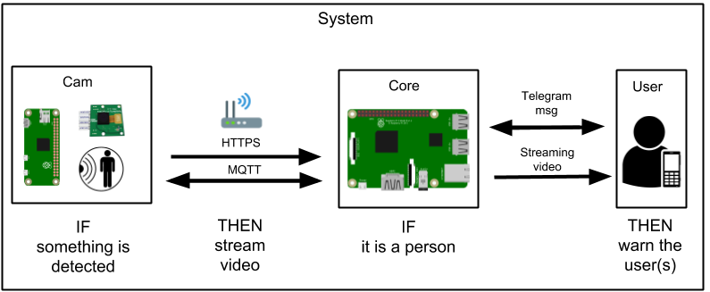

# Home Surveillance with Human Detection

Simple home surveillance system using Raspberry Pi 3, Raspberry Pi Zero W and OpenCV.

## Hardware Requirements

* Raspberry Pi 3 Model B
* Raspberry Pi Zero W
* Raspberry Pi Camera
* PIR sensor ([HC-SR501](datasheet/Datasheet_HC-SR501.pdf))
* Two microSD (I recommend at least 8gb per card)

## Basic System Overview



## Getting Started

### Setup the Rasperries (same procedure for Pi3 and PiZero)

First of all you need to [download](https://www.raspberrypi.org/downloads/raspbian/) the raspbian image.

Then you need to make a bootable [microSD](https://www.raspberrypi.org/documentation/installation/installing-images/linux.md)

Now since the PiZero do not have a eth port, you should manually configure the remote access over WiFi.In another computer running Linux (or PC with Live CD) you could edit the following file

```
/etc/wpa_supplicant/wpa_supplicant.conf
```
adding the following

```
country="your country, es. IT"
ctrl_interface=DIR=/var/run/wpa_supplicant GROUP=netdev
update_config=1

network={
    ssid="SSID"
    psk="password"
    key_mgmt=WPA-PSK
}

```

To simplify the remote access, i recomand to set a static ip. You need to know your router ip address. Open terminal and type

```
ip route | grep default | awk '{print $3}'
```

then edit the following file

```
/etc/dhcpcd.conf
```
adding the following

```
#eth not necessary for PiZero
interface eth0
static ip_address = first 3 part of previous command result then add a number between 1 and 255
static routers = previous command result
static domain_name_servers = 8.8.8.8

interface wlan0
static ip_address =
static routers =
static domain_name_servers = 8.8.8.8

```
An example of what should look like your dhcpcd.conf file

```
interface eth0
static ip_address=192.168.1.222
static routers=192.168.1.1
static domain_name_servers=8.8.8.8

interface wlan0
static ip_address=192.168.1.222
static routers=192.168.1.1
static domain_name_servers=8.8.8.8
```
NOTE: Use different ip address for Pi3 and PiZero

Finally we need to enable ssh. Simply add an empty file on the /boot partition named “ssh”.

Put the SD card on your Pi and if everything works as I hope it would, you'll be able to connect to the Pi on your WiFi network typing

```
ssh pi@"the_ip_you_set_in_dhcpcd.conf"
```
The default password is "raspberry", i recommend you to change it with passwd command.

### Install Camera on PiZero

After connected to PiZero you need to enable the camera. This is done in raspi-config.

```
sudo raspi-config
```
then select "Interfacing Options " and finally enable the camera.
Let the system reboot once the camera is enabled. To test that the camera is working:

```
vcgencmd get_camera
```

### Prerequisites
